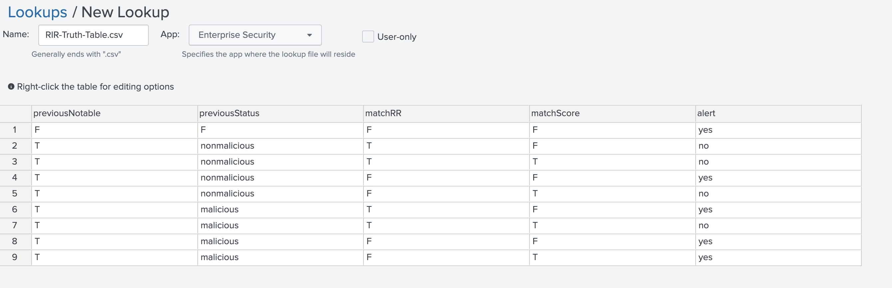
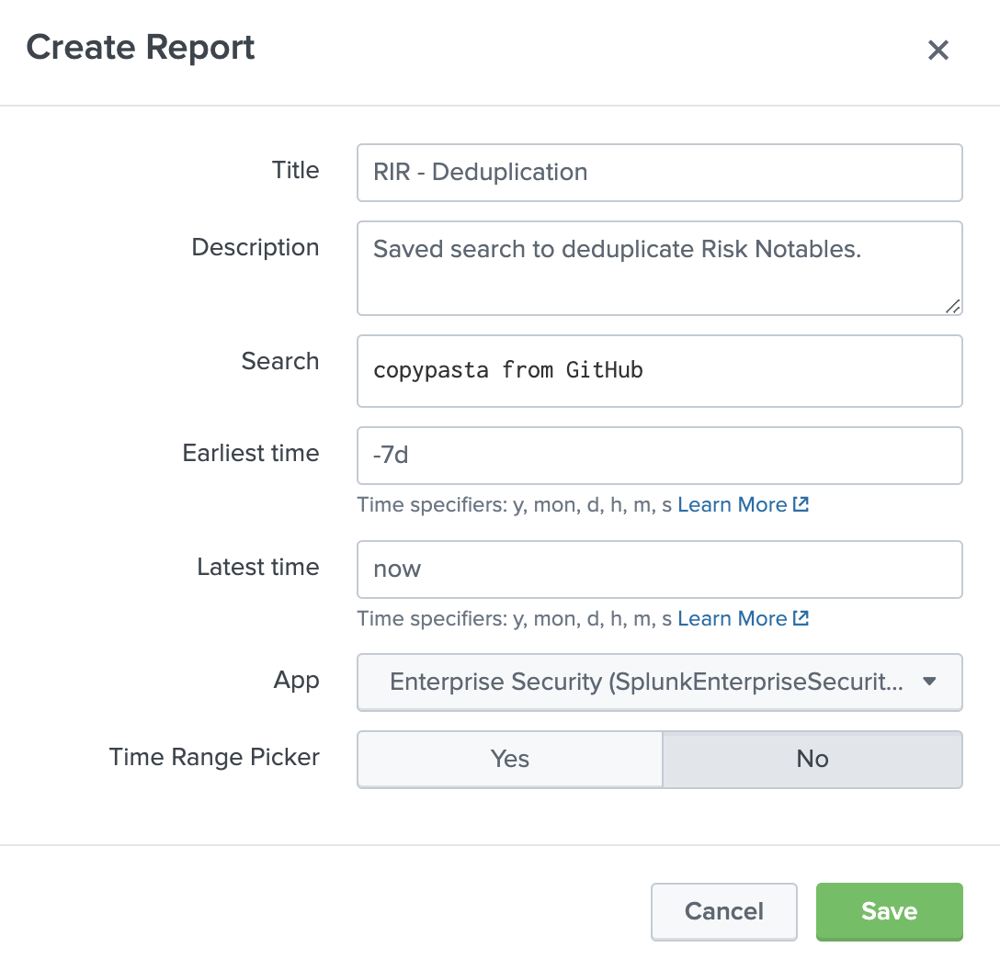
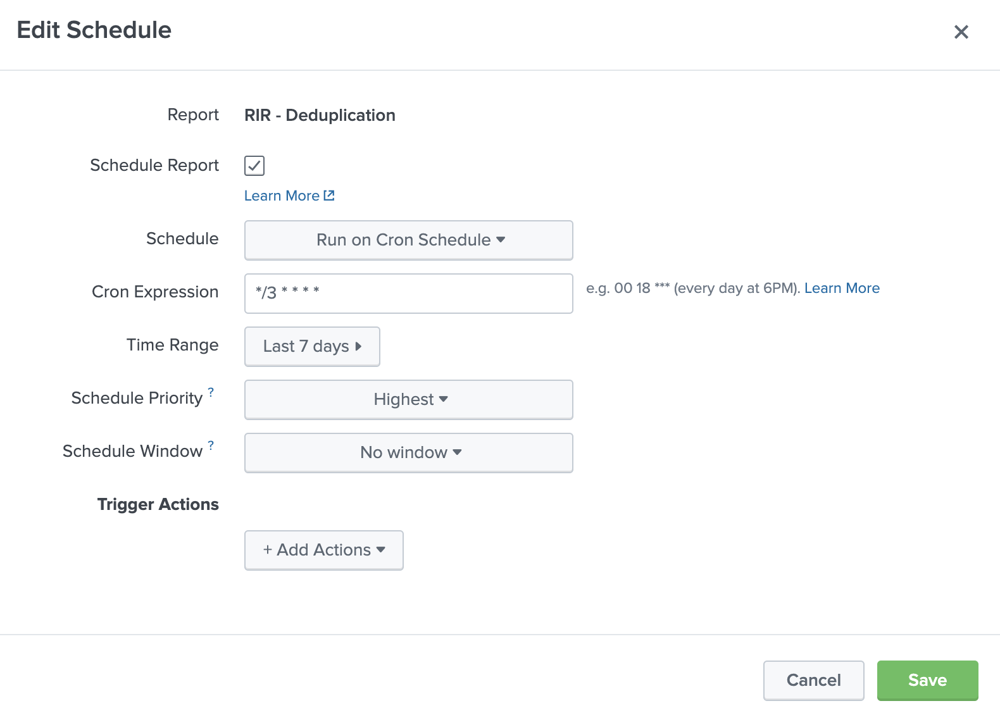
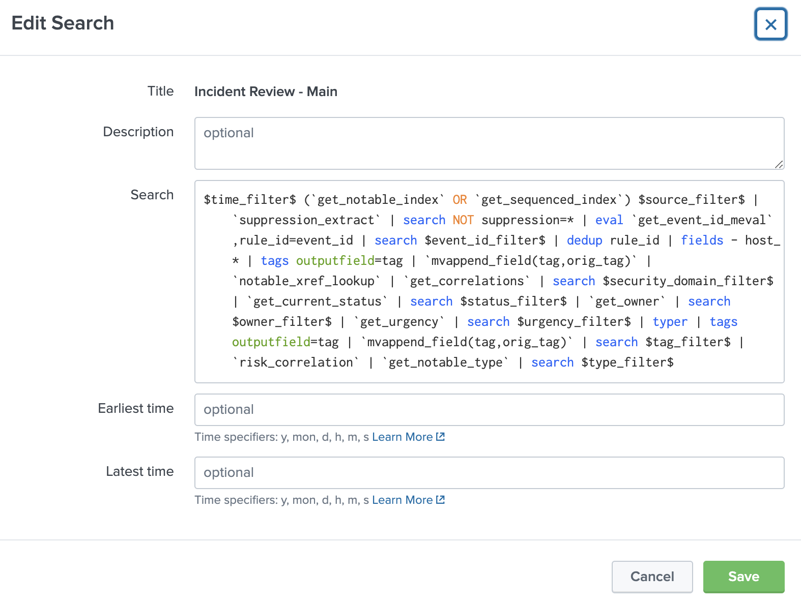
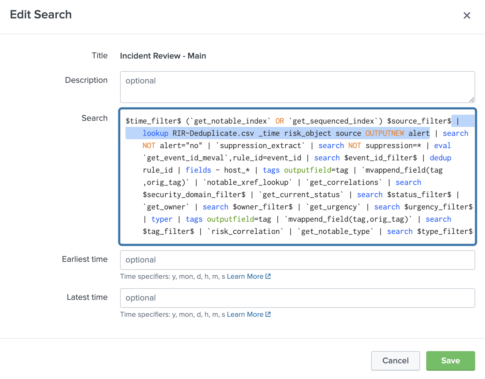
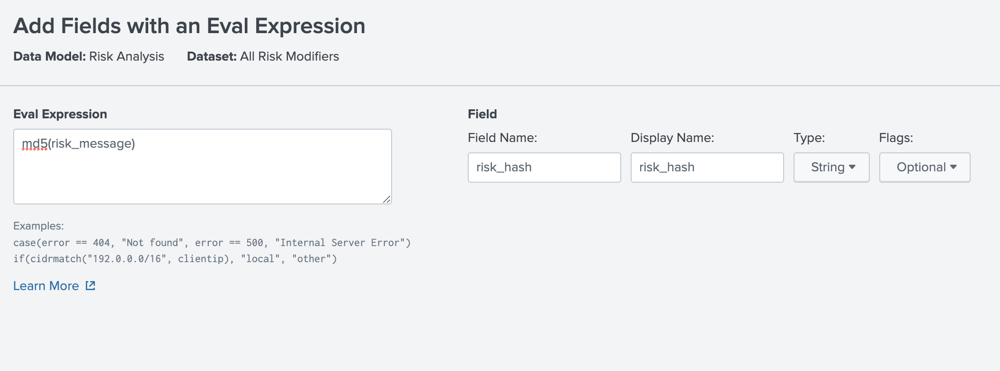

# Deduplicate Notable Events

!!! abstract "Throttle Alerts Which Have Already Been Reviewed or Fired"

Because Risk Notables look at a period of time, it is common for a risk_object to keep creating notables as additional (and even duplicate) events roll in, as well as when events fall off as the time period moves forward. Additionally, different Risk Incident Rules could be firing on the same risk_object with the same events but create new Risk Notables. It is difficult to get around this with throttling, so here are some methods to deduplicate notables.

## Navigation

Here are three methods for Deduplicating Notable Events:

- | Skill Level | Pros | Cons
- | ---------- | ---- | ----
[Method I](#method-i) | Intermediate | Deduplicates with easily adjustable logic
[Method II](#method-ii) | Beginner | Easy to get started with | Only deduplicates on back end
[Method III](#method-iii) | Educational Purposes Only | A more complex version of method 1, deprecated

## Method I

This incredible method was developed by @0xc0ffeeee from the RBA Community Slack, based on the (now deprecated) method III. You can see his personal GitHub commit [here](https://gist.github.com/0xC0FFEEEE/5fecd7fd36585a2279602132f5e98a37) and this version here just has some minor tweaks.

The idea here is we create a saved search that runs relatively frequently (perhaps every 30 minutes) over a decent timeframe (perhaps 30 days) which checks previous notables for what has changed for this entity, and then reports the reason it chose for `alert=no/yes` in `alert_reason` and stores this in a lookup - giving us the ability to choose when we get a new alert as well as a nice audit trail. You might want to create an additional saved search off of this to store a historical copy infrequently if necessary for audit purposes.

Dermot Gannon from Flutter made an excellent point that the original approach didn't include when a finding turned into an investigation post ES8, so I've added the ability to check the `mc_incidents` lookup for the investigation status instead of the notable event. To access fields in the `mc_incidents` lookup, you'll have to create a file-based KVstore lookup definition, point it to `mc_incidents` and then include these fields:

``` spl title="cc_mc_incidents_lookup"
_key,active_searches,assignee,attachments,count_findings,create_time,description,dest,display_id,disposition,dvc,id,implicit_finding_ids,incident_origin,incident_type,intermediate_finding_ids,is_ephemeral,is_finding_group,is_investigation,is_search_enriched,mc_create_time,name,notable_id,notes,orig_host,parent_incidents,response_plans,risk_event_count,risk_object,risk_score,searches,sensitivity,sla_completion_time,sla_expiry_time,source,src,src_user,status,update_time,urgency,user,version
```

Now let's create the saved search:

``` spl title="Risk Deduplication Lookup Generation"
index=notable eventtype=risk_notables
| eval risk_object=coalesce(normalized_risk_object, risk_object) 
| eval `get_event_id_meval`,`get_event_hash_meval` 
| fields _time event_hash event_id risk_object risk_object_type risk_score threat_object_info source contributing_source mitre_tactic_id_count mitre_technique_id_count
| eval temp_time=time()+86400 
| lookup update=true event_time_field=temp_time incident_review_lookup rule_id AS event_id OUTPUT status as new_status, disposition as new_disposition 
| lookup update=true correlationsearches_lookup _key as source OUTPUTNEW default_status, default_disposition 
| lookup cc_mc_incidents_lookup notable_id AS event_id OUTPUT parent_incidents AS parent_investigation
| lookup cc_mc_incidents_lookup id AS parent_investigation OUTPUT status AS investigation_status
| eval status=case(isnotnull(new_status),new_status,isnotnull(status),status,1==1,default_status) 
| eval disposition=case(isnotnull(new_disposition), new_disposition, isnotnull(disposition),disposition,1==1,default_disposition) 
| fields - temp_time,new_status,default_status,new_disposition,default_disposition 
| eval temp_status=if(isnull(status),-1,status) 
| eval temp_disposition=if(isnull(disposition),"disposition:6",disposition) 
| lookup update=true reviewstatuses_lookup _key as temp_status OUTPUT status,label as status_label 
| lookup update=true reviewstatuses_lookup _key as investigation_status OUTPUT status AS investigation_status label AS investigation_label
| lookup update=true disposition_lookup _key as temp_disposition OUTPUT status as disposition_status ,label as disposition_label 
| fields - temp_status, temp_disposition 
| eval sources = if(isnull(sources) , contributing_source , source )
| eval hasInvestigation = if(isnotnull(investigation_label),"T","F")
| eval status = if(isnotnull(investigation_status),investigation_status,status)
| eval status_label = if(isnotnull(investigation_label),investigation_label,status_label)
``` Begin dedup ```
| eventstats count as total_notables by risk_object, source
| eventstats values(sources) as sources, dc(sources) as dc_sources, dc(threat_object_info) as dc_to values(mitre_tactic_id_count) as dc_mitre_tactics values(mitre_technique_id_count) as dc_mitre_techniques by _time risk_object event_hash
| eval sources_hash=sha256(mvjoin(sources, "@@"))
| streamstats current=f window=0 max(_time) as latestTime, last(_time) as nextTime by risk_object, source
| eval isLatest=if(isnull(nextTime), "T", "F") 
| eval fwd_time_diff=nextTime-_time 
| eval nextTime=strftime(nextTime, "%Y-%m-%d %H:%M:%S") 
| eval latestTime=strftime(latestTime, "%Y-%m-%d %H:%M:%S")
| reverse 
| streamstats current=f window=0 
    count as order, 
    last(_time) as prevTime,
    latest(risk_score) as prev_risk_score,
    latest(status_label) as prev_status_label,
    latest(event_hash) as prev_event_hash,
    latest(sources_hash) as prev_sources_hash,
    latest(dc_sources) as prev_dc_sources,
    latest(dc_to) as prev_dc_to,
    latest(dc_mitre_tactics) as prev_dc_mitre_tactics,
    latest(dc_mitre_techniques) as prev_dc_mitre_techniques,
    latest(disposition_label) as prev_disposition_label
    by risk_object, source 
| eval order=order+1 
| eval bwd_time_diff=_time-prevTime 
| eval prevTime=strftime(prevTime, "%Y-%m-%d %H:%M:%S") 
| eval score_trend=case(
    risk_score>prev_risk_score, "↗",
    risk_score=prev_risk_score, "-",
    risk_score<prev_risk_score, "↘",
    isnull(prev_risk_score), "+"
    ) 
| eval scoreDecrease=if(risk_score<prev_risk_score, "T", "F") 
| eval scoreIncrease=if(risk_score>prev_risk_score, "T", "F")
| eval previousStatus=prev_status_label
| eval currentStatus=status_label
| eval previousDisposition = case( match(prev_disposition_label,"(Benign|False) Positive") , "nonmalicious", match(prev_disposition_label, "(True Positive)"), "malicious", true(), "undetermined") 
| eval currentDisposition = case( match(disposition_label,"(Benign|False) Positive") , "nonmalicious", match(disposition_label, "(True Positive)"), "malicious", true(), "undetermined")
| eval isNew=if(isnull(prev_event_hash), "T", "F") 
| eval alert_reason=case(
    match(currentStatus, "Closed|Resolved"), "yes@@Already actioned",
    currentStatus!="New", "yes@@In progress",
    dc_sources>prev_dc_sources, "yes@@New detection fired for object",
    scoreIncrease="T" AND (risk_score-prev_risk_score)<=10, "no@@Score increased by 10 or less",
    scoreDecrease="T" AND dc_to<prev_dc_to, "no@@Score and threat object count decreased",
    scoreDecrease="T", "no@@Score decreased - Needs more detail for better decision",
    isLatest="T" AND previousDisposition="nonmalicious" AND scoreDecrease="F" AND scoreIncrease="F", "no@@No change since last review",
    previousDisposition="nonmalicious" AND scoreDecrease="F" AND scoreIncrease="F", "no@@No change since last alert",
    fwd_time_diff<43200 AND isLatest="F", "no@@Newer notable within 12 hours",
    isNew="T", "yes@@New notable",
    scoreIncrease="T" AND isLatest="T", "yes@@Score increased",
    true(), "-@@-"
    ) 
| eval alert=mvindex(split(alert_reason, "@@"),0) 
| eval reason=mvindex(split(alert_reason, "@@"),1) 
| eval summary="[".strftime(_time, "%Y-%m-%d %H:%M:%S")."] ".alert." | ".risk_score." ".score_trend." ".reason
| streamstats current=f window=0 values(summary) as risk_object_history by risk_object, source
| eval risk_object_history=mvindex(risk_object_history,-10,-1)
| reverse 
| table _time source risk_object risk_object_type alert reason risk_object_history score_trend risk_score prev_risk_score total_notables order latestTime prevTime nextTime fwd_time_diff bwd_time_diff sources dc_sources prev_dc_sources sources_hash prev_sources_hash prev_dc_to dc_to prev_dc_mitre_tactics dc_mitre_tactics prev_dc_mitre_techniques dc_mitre_techniques event_hash prev_event_hash isLatest isNew currentStatus previousStatus currentDisposition previousDisposition scoreDecrease scoreIncrease disposition_label prev_disposition_label
| outputlookup rir_deduplicate.csv
```

Next we can apply this as an automatic lookup to the `stash` sourcetype:

```
rir_deduplicate.csv _time AS _time risk_object AS normalized_risk_object source AS source OUTPUTNEW alert AS alert
```

This lookup `rir_deduplicate.csv` can now be used to filter the analyst queue by adjusting the `get_notable_index` macro to:

```
(index=notable NOT (QA=1 OR alert=no))
```

Or saving a view in the Analyst Queue with `NOT alert=no`. Very useful and I daresay essential method for keeping duplicates from stacking up.

I haven't done as much testing with FBDs and this approach but you could use similar logic to prevent an FBD from firing and bringing it to the top of the queue unless things have significantly changed for this object. For example:

```
| tstats `summariesonly` `common_fbd_fields` from datamodel=Risk.All_Risk where earliest=-24h by All_Risk.normalized_risk_object, All_Risk.risk_object_type, index | `drop_dm_object_name("All_Risk")` | `get_mitre_annotations` | `generate_findings_summary_on_entity` | where risk_score > 100
| join type=left normalized_risk_object risk_object_type [
 | inputlookup rir_deduplicate.csv where isLatest=T
 | fields _time risk_object risk_object_type source currentDisposition currentStatus risk_score dc_sources dc_to dc_mitre_tactics dc_mitre_techniques
 | rename _time as prev_time risk_object AS normalized_risk_object currentDisposition as prev_disposition currentStatus as prev_status risk_score as prev_risk_score dc_sources as prev_source_count dc_to as prev_threat_object_count dc_mitre_tactics as prev_mitre_tactic_id_count dc_mitre_techniques as prev_mitre_technique_id_count
 | eval prev_time = strftime(prev_time, "%Y-%m-%d %H:%M:%S")
 ]
| eval alert_reason=case(
    match(prev_status, "Closed|Resolved") AND source_count=prev_source_count AND threat_object_count=prev_threat_object_count, "no - no new detections or threat objects",
    match(prev_status, "Closed|Resolved") AND (risk_score-prev_risk_score)<=20, "no - score increased by less than 20",
    true(), "yes")
| where alert_reason="yes"
```

Which adjusts the standard Risk Score Threshold Finding Based Detection so that if the previous FBD was closed or resolved, and either the sources + threat objects are the same or the score increased by less than 20, we prevent the FBD from firing again. I've included some additional fields like MITRE counts in case you'd like to use those as well!

---

## Method II

This method is elegantly simple to ensure notables don't re-fire as earlier events drop off the rolling search window of your Risk Incident Rules but the score is still above the threshold; you've already dealt with the notable when it had the highest score so you don't need to see it again. It does this by only firing if the latest risk event is from the past 70 minutes.

Because _indextime is not stored in the risk datamodel, you will have to add the hidden field _indextime from the raw events to the risk DM to use in default RIRs. Create a calculated field called index_time with an eval of `_indextime`, re-accelerate and rebuild the DM, then add `latest(All_Risk.index_time) AS latest_event` to the base search of your RIR and immediately following:

``` spl title="Append to existing RIR"
...
| where latest_event >= relative_time(now(),"-70m@m")
```

Credit to Josh Hrabar and James Campbell, this is brilliant. Thanks y'all!

---

## Method III

We'll use a Saved Search to store each Risk Notable's risk events and our analyst's status decision as cross-reference for new notables. Altogether new events will still fire, but repeated events from the same source will not. This also takes care of duplicate notables on the back end as events roll off of our search window.

!!! tip "KEEP IN MIND"

    Edits to the **Incident Review - Main** search ***may*** be replaced on updates to Enterprise Security; requiring you to make this minor edit again to regain this functionality. Ensure you have a step in your relevant process to check this search after an update.

### 1. Create a Truth Table

This method is described in [Stuart McIntosh's 2019 .conf Talk](https://conf.splunk.com/files/2019/recordings/SEC1908.mp4){ target=_blank } (about 9m10s in), and we're going to create a similar [lookup table](https://github.com/splunk/rba/blob/main/lookups/RIR-Truth-Table.csv){ target=_blank }. You can either download and import that file yourself, or create something like this in the [Lookup Editor app](https://splunkbase.splunk.com/app/1724){ target=_blank }:

<figure markdown>
  
  <figcaption>Truth Table</figcaption>
</figure>

### 2. Create a Saved Search

Then we'll create a Saved Search which runs relatively frequently to store notable data and statuses.

1. Navigate to Settings -> Searches, reports, and alerts.
1. Select "New Report" in the top right.

!!! quote ""
    Here is a sample to replicate

<figure markdown>
  
  <figcaption>Sample Report</figcaption>
</figure>

``` shell title="With this SPL" linenums="1" hl_lines="19"
index=notable eventtype=risk_notables
| eval indexer_guid=replace(_bkt,".*~(.+)","\1"),event_hash=md5(_time._raw),event_id=indexer_guid."@@".index."@@".event_hash
| fields _time event_hash event_id risk_object risk_score source orig_source
| eval temp_time=time()+86400
| lookup update=true event_time_field=temp_time incident_review_lookup rule_id AS event_id OUTPUT status as new_status
| lookup update=true correlationsearches_lookup _key as source OUTPUTNEW default_status
| eval status=case(isnotnull(new_status),new_status,isnotnull(status),status,1==1,default_status)
| fields - temp_time,new_status,default_status
| eval temp_status=if(isnull(status),-1,status)
| lookup update=true reviewstatuses_lookup _key as temp_status OUTPUT status,label as status_label
| fields - temp_status
| eval sources = if(isnull(sources) , orig_source , sources )
| table _time event_hash risk_object source status_label sources risk_score
| reverse
| streamstats current=f window=0 latest(event_hash) as previous_event_hash values(*) as previous_* by risk_object
| eval previousNotable=if(isnotnull(previous_event_hash) , "T" , "F" )
| fillnull value="unknown" previous_event_hash previous_status_label previous_sources previous_risk_score
| eval matchScore = if( risk_score != previous_risk_score , "F" , "T" )
| eval {==previousStatus==} = case( match(previous_status_label, "(Closed)") , "nonmalicious" , match(previous_status_label, "(New|Resolved)") , "malicious" , true() , "malicious" )
# (1)!
| mvexpand sources
| eval matchRR = if(sources != previous_sources , "F", "T")
| stats  dc(sources) as dcSources dc(matchRR) as sourceCheckFlag values(*) as * by _time risk_object event_hash
| eval matchRR = if(sourceCheckFlag > 1 , "F" , matchRR )
| lookup RIR-Truth-Table.csv previousNotable previousStatus matchRR matchScore OUTPUT alert
| table _time risk_object source risk_score event_hash dcSources alert previousNotable previousStatus matchRR matchScore
| outputlookup RIR-Deduplicate.csv
```

1. `previousStatus` uses the default ES status label "Closed".

In the SPL for `previousStatus` above, I used the default ES status label "Closed" as our only nonmalicious status. You'll have to make sure to use status labels which are relevant for your Incident Review settings. "Malicious" is used as the fallback status just in case, but you may want to differentiate "New" or unmatched statuses as something else for audit purposes; just make sure to create relevant matches in your truth table.

!!! tip "I recommend copying the alert column from malicious events"

#### Schedule the Saved Search

``` markdown title="Create schedule"
    Now find the search in this menu, click *Edit -> Edit Schedule* and try these settings:
```

<div class="result" markdown>

{ align=right width=650 }

- **Schedule:** Run on Cron Schedule
- **Cron Expression:** `*/3 * * * *`
- **Time Range:** Last 7 days
- **Schedule Priority:** Highest
- **Schedule Window:** No window

</div>

I made this search pretty lean, so running it every three minutes should work pretty well; I also decided to only look back seven days as this lookup could balloon in size and cause bundle replication issues. You probably want to stagger your Risk Incident Rule cron schedules by one minute more than this one so they don't fire on the same risk_object with the same risk events.

### 3. Deduplicate notables

Our last step is to ensure that the Incident Review panel doesn't show us notables when we've found a match to our truth table which doesn't make sense to alert on. In the *Searches, reports, alerts* page, find the search **Incident Review - Main** and click Edit -> Edit Search.

!!! quote ""
    By default it looks like this:

<figrue markdown>
  
  <figcaption>Default incident review search</figcaption>
</figure>

!!! note "And we're just inserting this line after the base search"

    ```shell title="Append to the base search" linenums="1"
    ...
    | lookup RIR-Deduplicate.csv _time risk_object source OUTPUTNEW alert
    | search NOT alert="no"
    ```

<figure markdown>
  
  <figcaption>Updated incident review search</figcaption>
</figure>

### Congratulations! :partying_face:

You should now have a significant reduction in duplicate notables

If something isn't working, make sure that the Saved Search is correctly outputting a lookup (which should have Global permissions), and ensure if you `| inputlookup RIR-Deduplicate.csv` you see all of the fields being returned as expected. If Incident Review is not working, something is wrong with the lookup or your edit to that search.

### Extra Credit

If you utilize the [Risk info field](./risk_info_event_detail.md) so you have a short and sweet risk_message, you can add another level of granularity to your truth table.

!!! tip "if you utilize risk_message for ALL of the event detail, it may be *too* granular and isn't as helpful for throttling."

This is especially useful if you are creating risk events from a data source with its own signatures like EDR, IDS, or DLP. Because the initial truth table only looks at score and correlation rule, if you have one correlation rule importing numerous signatures, you may want to alert when a new signature within that source fires.

### Create a calculated field

First, we'll create a new Calculated Field from risk_message in our Risk Datamodel called risk_hash with eval's `md5()` function, which bypasses the need to deal with special characters or other strangeness that might be in that field. If you haven't done this before - no worries - you just have to go to *Settings -> Data Models -> Risk Data Model -> Edit -> Edit Acceleration* and turn this off. Afterwards, you can *Create New -> Eval Expression* like this:

<figure markdown>
  
  <figcaption>Creating risk_hash from md5(risk_message) in data model</figcaption>
</figure>

???+ danger "Don't forget to re-enable the acceleration"
    You may have to rebuild the data model from the **Settings -> Data Model** menu for this field to appear in your events.

### Update SPL

Then we have to add this field into our Risk Incident Rules by adding this line to their initial SPL and ensure this field is retained downstream:

``` shell title="Field to add to RiR"
values(All_Risk.risk_hash) as risk_hashes
```

Now our Risk Notables will have a multi-value list of `risk_message` hashes. We must update our truth table to include a field called "matchHashes" - I've created a sample truth table [here](https://github.com/splunk/rba/blob/main/lookups/RIR-Truth-Table-Hashes.csv){ target=_blank }, but you must decide what is the proper risk appetite for your organization.

Next we'll edit the Saved Search we created above to include the new fields and logic:

``` shell title="Updated logic (changes highlighted)" linenums="1" hl_lines="10-13"
...
| eval sources = if(isnull(sources) , orig_source , sources )
| table _time event_hash risk_object source status_label sources risk_score {==risk_hashes==}
| reverse
| streamstats current=f window=0 latest(event_hash) as previous_event_hash values(*) as previous_* by risk_object
| eval previousNotable=if(isnotnull(previous_event_hash) , "T" , "F" )
| fillnull value="unknown" previous_event_hash previous_status_label previous_sources previous_risk_score {==previous_risk_hashes==}
| eval matchScore = if( risk_score != previous_risk_score , "F" , "T" )
| eval previousStatus = case( match(previous_status_label, "(Closed)") , "nonmalicious" , match(previous_status_label, "(New|Resolved)") , "malicious" , true() , "malicious" )
| mvexpand risk_hashes
| eval matchHashes= if(risk_hashes != previous_risk_hashes , "F" , "T" )
| stats dc(matchHashes) as hashCheckFlag values(*) as * by _time risk_object event_hash
| eval matchHashes = if(hashCheckFlag > 1 , "F" , matchHashes )
| mvexpand sources
| eval matchRR = if(sources != previous_sources , "F", "T")
| stats  dc(sources) as dcSources dc(matchRR) as sourceCheckFlag values(*) as * by _time risk_object event_hash
| eval matchRR = if(sourceCheckFlag > 1 , "F" , matchRR )
| lookup RIR-Truth-Table.csv previousNotable previousStatus matchRR matchScore {==matchHashes==} OUTPUT alert
| table _time risk_object source risk_score event_hash dcSources alert previousNotable previousStatus matchRR matchScore {==matchHashes==}
| outputlookup RIR-Deduplicate.csv
```

Voila! We now ensure that our signature-based risk rule data sources will properly alert if there are interesting new events for that risk object.

---

<small>Authors</small>

<div class="zts-tooltip">
    <a class="zts-author" href="../../contributing/contributors" target="_blank" alt="7thdrxn - Haylee Mills">
        
    </a>
    <span class="zts-tooltip-text">@7thdrxn - Haylee Mills</span>
</div>
