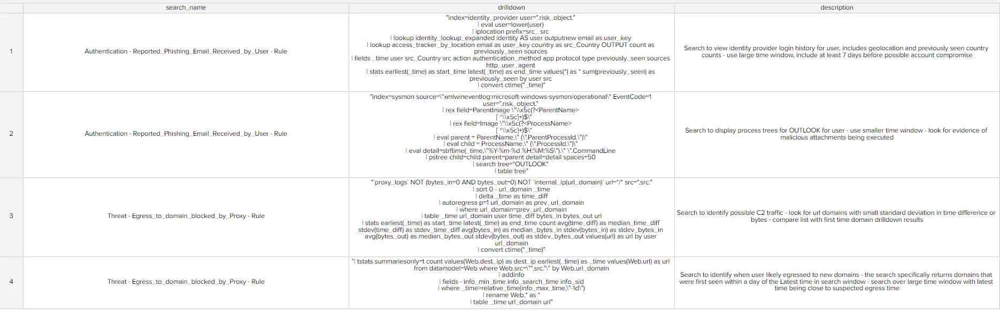

# Dynamic Drilldowns by Source

If you're utilizing a custom risk notable investigation dashboard, it can be incredibly helpful for each risk event source to have its own drilldown. Thanks to [Donald Murchison](../contributing/contributors.md) from the RBA Slack for contributing this method, which is explained in more detail in this [blog post](https://medium.com/@donemurch/lookup-to-drilldown-building-dynamic-searches-for-triaging-risk-notables-in-splunk-87c976711f7a){ target="blank" }.

## Create a Drilldown Lookup

First you'll need a lookup file with your risk rule name, the drilldown itself, and a description, like so:

<figure markdown>

<figcaption>Specific drilldowns will help analysts find exactly what they want to know</figcaption>
</figure>

You can utilize this example from Donald's article and change it to suit your purposes.

## Create your Drilldown Panel

In Donald's example, this panel shows the list of sources for the risk object indicated by `$risk_object_token$` (which you will need to ensure matches whatever token your dashboard uses), a description, and the drilldown logic itself. Here is the SPL and helpful comments:

```shell linenums="1" title="Drilldown Panel SPL"
| tstats summariesonly=false count from datamodel=Risk.All_Risk where All_Risk.risk_object="$risk_object_token$" by source
``` Get a list of all risk rules that have generated a risk event for this risk object - assumes the dashbaord has an input which stores risk_object in "risk_object_token"
replace risk_object_token with your own token name - helpful to use risk_object_type in search if this is in a token as well ```
| fields source
``` Use map to run a search for each risk rule to generate the drilldowns - map was used to be able to pass the risk rule name as an argument to the subsearch.
This is required because we must run an individual "
| eval drilldown=…" for each risk rule in case fields are used in the drilldown that do not exist in other risk events.
String concatentation with a null field would make our entire string null.
If you wanted to remove map for better performance you could do this by only using fields that are present in every risk rule or building drilldowns with coalesce - coalesce(risk_object,\"\") - to ensure no null fields```
| map search="index=risk risk_object=\"$risk_object_token$\" | eval drilldown=[| inputlookup rba_risk_rule_drilldowns.csv | eval search_name=split(search_name,\"|\") | search search_name=\"$$source$$\" | eval drilldown=\"\\\"\".search_name.\"||@||\\\".\".drilldown.\".\\\"||@||\".description.\"\\\"\"
``` In the map search, we first search for all risk events related to the risk rule. Every risk event will get a drilldown field that we will dedup later. We do not use the datamodel in case fields outside of the datamodel are used in the drilldown.
The |inputlookup subsearch concatenates search_name, drilldown, and description for each row```
| stats values(drilldown) as drilldown
| eval drilldown=mvjoin(drilldown,\".\\\"||&||\\\".\")
``` We then condense all drilldowns to a single field and concatenate together - this allows us to evaluate all drilldowns within a single eval statement```
|return $drilldown] | fields drilldown"
```Now we break out the drilldowns into their respective components```
| eval drilldown=split(drilldown,"||&||")
| mvexpand drilldown
| eval search_name=mvindex(split(drilldown,"||@||"),0)
| eval drilldown_description=mvindex(split(drilldown,"||@||"),2)
| eval drilldown=mvindex(split(drilldown,"||@||"),1)
| stats values(*) as * by drilldown
``` Use stats to dedup the drilldowns - depending on the fields used in the drilldown there could be multiple variations of the same drilldown```
| table search_name drilldown_description drilldown
```

## Add Drilldown Functionality

You can follow along with Donald's article to add the drilldown in the GUI editor, but the SimpleXML for this panel would be:

```shell linenums="1" title="Drilldown SimpleXML"
<drilldown>
<link target="_blank">search?q=$row.drilldown$&amp;earliest=$field1.earliest$&amp;latest=$field1.latest$</link>
</drilldown>
```

For a click anywhere on that row to drive the search. Make sure your time picker tokens match here as well!

You could also utilize the time around an event by retaining `_time` in the initial search and declaring this later in SPL:
```shell linenums="1" title="Extra Time Control"
| eval lowtime = _time - 300
| eval hightime = _time + 300
```

So you could use `$row.lowtime$` and `$row.hightime$` for your drilldown and search a five minute window around an event instead of utilizing the standard time picker for your dashboard.

## Customize Your Heart Out

This is a great way to incorporate something akin to Workflow Actions for your custom dashboards. You could go a bit further and potentially:

- Include `risk_message` in your drilldown panel for more context
- Hide the drilldown field in the panel to save real estate with `<fields>` in SimpleXML
- Utilize `case(isnull(drilldown)` logic to utilize generalized drilldowns in case nothing is explicitly defined

Just as examples. Please share your variations on the RBA Slack!

---

<small>Authors</small>

<div class="zts-tooltip">
    <a class="zts-author" href="../../contributing/contributors/" target="_blank" alt="7thdrxn - Haylee Mills">
        
    </a>
    <span class="zts-tooltip-text">@7thdrxn - Haylee Mills</span>
</div>
<div class="zts-tooltip">
    <a class="zts-author" href="../../contributing/contributors/" target="_blank" alt="Donald Murchison">
        
    </a>
    <span class="zts-tooltip-text">Donald Murchison</span>
</div>
