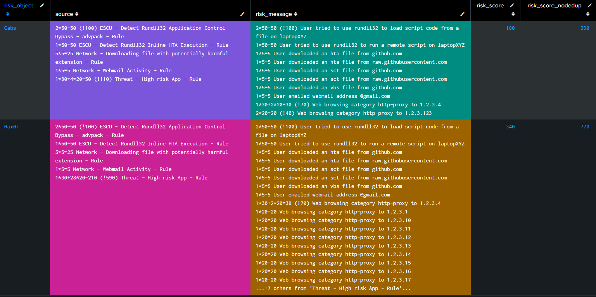

# Limit Risk Rule Score Stacking

These will help reduce the maximum amount of risk which can be added from noisy Risk Rules.

## Navigation

There are two methods for limiting score stacking

- | Skill Level | Pros | Cons
- | ---------- | ---- | ----
[Method I](#method-i) | Beginner | Easy to get started with | Less context around what was capped and why
[Method II](#method-ii) | Intermediate | More precise deduplication and additional information | Additional understanding of SPL

## Method I

This caps the risk score contribution of a single source by 3x the highest score from that source.

```shell linenums="1"
| tstats summariesonly=true sum(All_Risk.calculated_risk_score) as summed_risk_score max(All_Risk.calculated_risk_score) as single_risk_score dc(source) as source_count count
 FROM datamodel=Risk.All_Risk
 WHERE All_Risk.risk_object_type="*" (All_Risk.risk_object="*" OR risk_object="*")
 BY All_Risk.risk_object All_Risk.risk_object_type source
| eval capped_risk_score=if(summed_risk_score < single_risk_score*3, summed_risk_score, single_risk_score*3)
| stats sum(capped_risk_score) as capped_risk_score sum(summed_risk_score) as summed_risk_score dc(source) as source sum(count) as count
 BY All_Risk.risk_object All_Risk.risk_object_type
| sort 1000 - risk_score
...
```

!!! note
     You may want to limit this to particular sources, but this is extra handy for noisy sources like EDR, DLP, or IDS.

    Thanks David Dorsey!

## Method II

This option adds some complexity, however, provides more information and better deduplication. The full write-up of how to accomplish this method can be found on [gabs website](https://www.gabrielvasseur.com/post/rba-a-better-way-to-dedup-risk-events){ target="blank" }.

[Visit Website :octicons-link-external-16:](https://www.gabrielvasseur.com/post/rba-a-better-way-to-dedup-risk-events "See full blog post"){ .md-button .md-button--primary target="_blank" }


<small>_**\*reference:** [https://www.gabrielvasseur.com/post/rba-a-better-way-to-dedup-risk-events](https://www.gabrielvasseur.com/post/rba-a-better-way-to-dedup-risk-events){ target="blank" }_</small>


```spl title="Final SPL from blog post"
| inputlookup TEMP_GABS_riskybusiness.csv
``` First we take the breakdown of what actually happened, before doing any kind of deduping ```
| eventstats sum(count) as count_msg
    by risk_object risk_object_type risk_score source risk_message ```Get breakdown per risk_message``` 
| eventstats values(eval(count_msg."*".risk_score)) as breakdown_msg
    by risk_object risk_object_type            source risk_message ```Get breakdown per risk_message```
| eventstats sum(count) as count_src
    by risk_object risk_object_type risk_score source ```Get breakdown per source```
| eventstats values(eval(count_src."*".risk_score)) as breakdown_src
    by risk_object risk_object_type            source ```Get breakdown per source```
| stats sum(count) as risk_event_count, values(breakdown_src) as breakdown_src,
    values(breakdown_msg) as breakdown_msg, sum(eval(risk_score*count)) as total_score,
    max(risk_score) as max_score, latest(_time) as _time, values(mitre_*) as mitre_*
    by risk_object risk_object_type source risk_message ```Reduce to unique risk_message
    (it's not impossible to have several risks with the same risk_message but different scores)```
| eval risk_message= mvjoin(breakdown_msg,"+")."=".max_score
    . if( total_score!=max_score, " (!" . total_score . ")", "") . " " .risk_message
``` START limit to a maximum of 10 contributions per source ```
| sort 0 risk_object risk_object_type source - max_score ``` Only the lowest scores will be dedup'd ```
| eventstats dc(risk_message) as dc_msg_per_source by risk_object risk_object_type source 
| streamstats count as rank_per_source by risk_object risk_object_type source 
| eval risk_message=case( 
    rank_per_source <= 10, risk_message,
    rank_per_source = 11, "...+" . ( dc_msg_per_source - 20 ) . " others from '" . source . "'..." ,
    1==1, null() ) 
| eval max_score=if( rank_per_source <= 10, max_score, 0 )
``` END limit to a maximum of 10 contributions per source ```
| stats sum(risk_event_count) as risk_event_count, values(breakdown_src) as breakdown_src,
    list(risk_message) as risk_message, sum(max_score) as risk_score,
    sum(total_score) as risk_score_nodedup, latest(_time) as _time, values(mitre_*) as mitre_*
    by risk_object risk_object_type source ```Reduce to unique source```
| eval breakdown_src = mvjoin(breakdown_src,"+") ."=".risk_score
    . if( risk_score!=risk_score_nodedup, " (!" . risk_score_nodedup . ")", "" ) . " ".source
| stats sum(risk_event_count) as risk_event_count, list(source) as source, dc(source) as source_count,
    list(breakdown_src) as srcs, list(risk_message) as risk_message, sum(risk_score) as risk_score,
    sum(risk_score_nodedup) as risk_score_nodedup, latest(_time) as _time, values(mitre_*) as mitre_*,
    dc( mitre_tactic_id) as mitre_tactic_id_count, dc(mitre_technique_id) as mitre_technique_id_count
    by risk_object risk_object_type ```Reduce to unique object```
```

---
<small>Authors</small>

<div class="zts-tooltip">
    <a class="zts-author" href="../../contributing/contributors" target="_blank" alt="7thdrxn - Haylee Mills">
        
    </a>
    <span class="zts-tooltip-text">@7thdrxn - Haylee Mills</span>
</div>
<div class="zts-tooltip">
    <a class="zts-author" href="../../contributing/contributors" target="_blank" alt="gabs - Gabriel Vasseur">
        
    </a>
    <span class="zts-tooltip-text">@gabs - Gabriel Vasseur</span>
</div>
