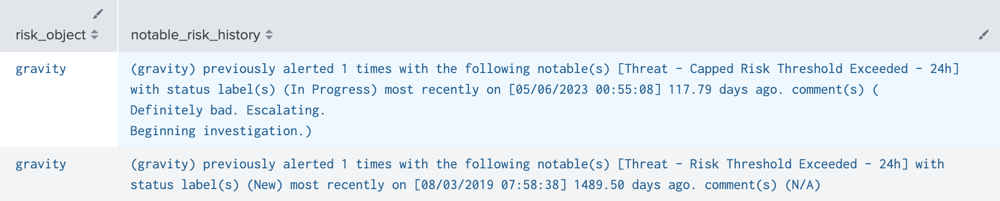

# Risk Notable History

Tyler Younger from the RBA Slack contributed this handy method for including some useful history of risk notables for that risk object when it fires. I played with it a bit and created a version I might use in a dashboard for additional context. You should check with your analysts to see what would be most helpful for them.

## Adding Risk Notable History

You could add this subsearch to your Risk Incident Rules and add this field to Incident Review Settings so analysts see it reviewing a notable event, or maybe have it as a panel in an investigation dashboard. I will leave it with the `makeresults` and tabled results as an example so you can play around until it looks right.

```shell linenums="1"
| makeresults
| eval risk_object="tyounger"
| join type=left max=0 risk_object
    [| search earliest=-31d latest=now `notable`
    ``` ### This may or may not make sense in your enviornment, the idea was to tidy up the search names, adjust as needed
    ```
   | replace "* - Rule" WITH * IN search_name
   | replace "Audit - UC - *" WITH * IN search_name
   | replace "Threat - UC - *" WITH * IN search_name
   | replace "Access - UC - *" WITH * IN search_name
   | replace "Network - UC -*" WITH * IN search_name
   | replace "Identity - UC -*" WITH * IN search_name
   | replace "Endpoint - UC -*" WITH * IN search_name
   ``` ### ```
    | eventstats count as history_count dc(search_name) as search_name_count values(search_name) as search_names first(_time) as last_time by risk_object,search_name
    | eval days_ago=round((abs(last_time-now())/86400),2)
    | convert ctime(first_time) as first_time
    | convert ctime(last_time) as last_time
    | eval history_count=if(isnull(history_count)," new", history_count)
    | eval search_names=if(isnull(search_names)," search null",search_names)
    | eval last_time=if(isnull(last_time)," last time null",last_time)
    | eval days_ago=if(isnull(days_ago)," days ago null",days_ago)
    | fillnull comment value="N/A"
    | table risk_object sources rule_name history_count risk_object first_time last_time search_name_count search_names days_ago status_label comment
        ]
    ``` ### Format history fields ### ```
| eval notable_risk_history="(".risk_object. ") previously alerted ".history_count." times with the following notable(s) [".search_names."]"." with status label(s) (".status_label.") most recently on [".last_time."] ".days_ago." days ago. comment(s) comments: (".comment.")"
| eval notable_risk_history=if(isnull(notable_risk_history),"Risk object has not generated any notable events",notable_risk_history)
| eval search_names=if(isnull(search_names),"N/A",search_names)
| makemv delim="comments: " notable_risk_history
| eval notable_risk_history=mvjoin(notable_risk_history, "")
| table risk_object notable_risk_history
```



You should be able to simply use the `join` and logic all the way up to the final table command and perhaps make a macro for this to be added to the end of your Risk Incident Rules and provide that context.

## Adding Risk and Traditional Notable History

You might want to check other fields in regular notables to see if this object appears there as well. In this example, I am using `coalesce` to check `src`, `dest`, and `user` and bring those in on the join. Just replace "gravity" in both spots of this example to pull events for the object you want to get events for. I'm also playing with the spacing and formatting of the final results in case that gives you some ideas:

```shell linenums="1"
| makeresults
| eval risk_object="gravity"
| join type=left max=0 risk_object
    [| search earliest=-5000d latest=now gravity `notable`
    ``` ### This may or may not make sense in your enviornment, the idea was to tidy up the search names, adjust as needed
    ```
   | replace "* - Rule" WITH * IN search_name
   | replace "* - Combined" WITH * IN search_name
   | replace "Audit - *" WITH * IN search_name
   | replace "Threat - *" WITH * IN search_name
   | replace "Access - *" WITH * IN search_name
   | replace "Network -*" WITH * IN search_name
   | replace "Identity -*" WITH * IN search_name
   | replace "Endpoint -*" WITH * IN search_name
   ``` ### ```
   | eval risk_object=coalesce(risk_object,src)
   | eval risk_object=coalesce(risk_object,dest)
   | eval risk_object=coalesce(risk_object,user)
   | eval comment = "|||---- ".comment
    | eventstats count as history_count dc(search_name) as search_name_count values(search_name) as search_names latest(_time) as last_time latest(status_label) as status_label values(comment) as comments by risk_object,search_name
    | dedup risk_object,search_name
    | convert ctime(last_time) as last_time
    | fillnull history_count search_names last_time value="N/A"
    | fillnull comments value="---- no comments"
    | eval comments = mvjoin(comments,"")
    | table risk_object history_count risk_object last_time time search_name_count search_name status_label comments
        ]
    ``` ### Format history fields ### ```
| eval notables = last_time." - ".history_count." - ".search_name." :: ".upper(status_label)."|||".comments
| stats sum(history_count) as history_count values(notables) as notables by risk_object
| eval notables = mvjoin(notables,"||| |||-- ")
| eval notable_history="(+. ".upper(risk_object). " .+) previously alerted ".history_count." times with the following notable(s):||| |||-- ".notables
| eval notable_history=split(notable_history,"|||")
| fields - notables history_count
| eval notable_history=if(isnull(notable_history),"Risk object has not generated any notable events",notable_history)
```


Either way, letting your analysts know what was seen before is helpful context when they begin investigating.

---

<small>Authors</small>

<div class="zts-tooltip">
    <a class="zts-author" href="../../contributing/contributors/" target="_blank" alt="Tyler Younger">
        
    </a>
    <span class="zts-tooltip-text">Tyler Younger</span>
</div>

